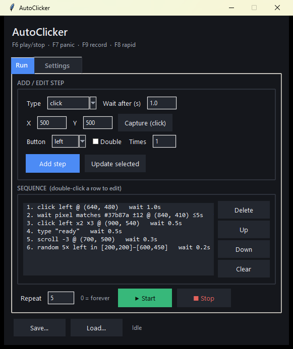
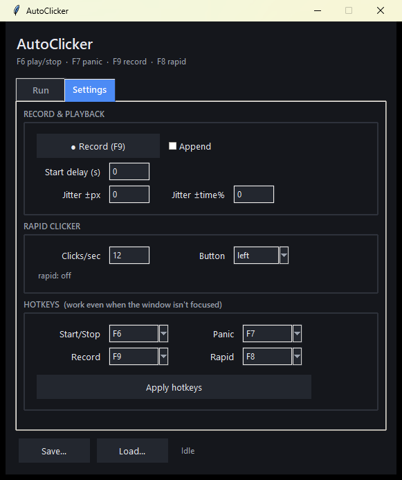

# AutoClicker

A self-contained click & macro sequencer for Windows. It can replay a list of
mouse/keyboard steps, spam-click at a set rate, react to on-screen pixel colours,
and record your real clicks — all from a small dark-themed GUI.

Pure Python standard library only: **tkinter** for the UI and **ctypes** for the
Win32 API. No `pip install`, no third-party tools. Multi-monitor and DPI aware.



## Download (no Python needed)

Grab the latest **`AutoClicker.exe`** from the
[Releases page](../../releases) and double-click it — it's a single self-contained
file, nothing to install. (Windows SmartScreen may warn about an unknown publisher
the first time: *More info → Run anyway*.)

## Run from source

```sh
python autoclicker.py
```

Requires Python 3.8+ on Windows. Nothing else to install.

## Build the EXE yourself

Pushing a version tag builds and publishes the exe automatically via GitHub Actions
(see [.github/workflows/build.yml](.github/workflows/build.yml)):

```sh
git tag v1.0.0
git push origin v1.0.0
```

To build it locally instead:

```sh
pip install pyinstaller
pyinstaller --onefile --windowed --name AutoClicker autoclicker.py
# result: dist/AutoClicker.exe
```

## Features

- **Step sequencer** — chain steps and loop them N times (0 = forever):
  - `click` — left/right/middle, optional double-click, repeat N times
  - `move` — move the cursor to a point
  - `scroll` — wheel up/down at a point
  - `type` — type a line of text
  - `random-area` — click random spots inside a rectangle
  - `wait-color` — pause until a screen pixel matches (or differs from) a colour
- **Rapid clicker (CPS)** — press a hotkey to spam-click at the cursor at a set
  clicks-per-second.
- **Pixel / colour detection** — `wait-color` steps gate playback on what's on
  screen, with an adjustable tolerance and optional timeout. Use **Pick color** to
  grab the colour under the cursor.
- **Click recording** — record your real mouse clicks with timing; append or replace.
- **Humanising jitter** — randomise click position (±px) and wait time (±%).
- **Global hotkeys** — work even when the window isn't focused, and are re-bindable.
- **Capture & select on screen** — click to capture a position, or drag to select an
  area; both work across **all monitors** (including screens left of the primary).
- **Save / load** sequences and settings as JSON.
- **Tooltips** on every non-obvious control.

## Using it

The window has two tabs:

### Run
1. Pick a step **Type**. The editor shows only the fields that step needs.
2. Fill in the values (use **Capture (click)** to grab a position by clicking on
   screen, or **Select area** to drag a box for `random-area`).
3. **Add step** to append it, or select a row and **Update selected** to edit it.
4. Set **Repeat** (0 = forever) and press **▶ Start** (or the start hotkey).

### Settings



- **Record & Playback** — record real clicks, set a start delay, and add jitter.
- **Rapid Clicker** — set clicks/sec and the mouse button; toggle it with its hotkey.
- **Hotkeys** — rebind any of the four global hotkeys, then **Apply hotkeys**.

## Default hotkeys

| Key | Action |
| --- | --- |
| F6  | Start / stop playback |
| F7  | Panic stop |
| F8  | Toggle rapid clicker |
| F9  | Start / stop recording |

## Notes

- Targets Windows only — it calls the Win32 API directly via `ctypes`.
- Coordinates are physical pixels and DPI-aware, so captured positions line up with
  where clicks actually land, even on high-DPI or multi-monitor setups.
